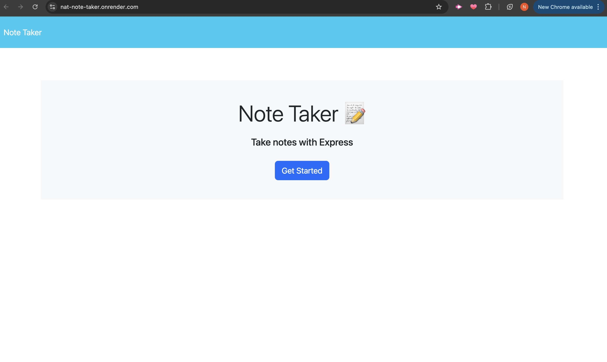

# nat-note-taker

## Description 

The challenge is to create an application called Note Taker that can be used to write and save notes. This application will use an Express.js back end and will save and retrieve note data from a JSON file.

## User Story

AS A small business owner
I WANT to be able to write and save notes
SO THAT I can organize my thoughts and keep track of tasks I need to complete

## Installation 

Clone repo, install dependencies with 'npm install', run 'node server.js'

## Usage

Access the application in your browser at http:///localhost:3001 to view, add or delete notes. 

or

Visit the deployed Render website: https://nat-note-taker.onrender.com/

## Screenshot 

## Resources

<a href="https://www.geeksforgeeks.org/how-to-build-note-taking-application-using-node-js/">Geeks for geeks</a>
<a href="https://www.youtube.com/watch?v=pxPRWGm7EHw">The webdev Youtube Channel</a>
<a href="https://medium.com/@nnamani.ezinne/simple-note-taking-app-using-node-js-and-ejs-4899321a3342">Medium Blog Page</a> 